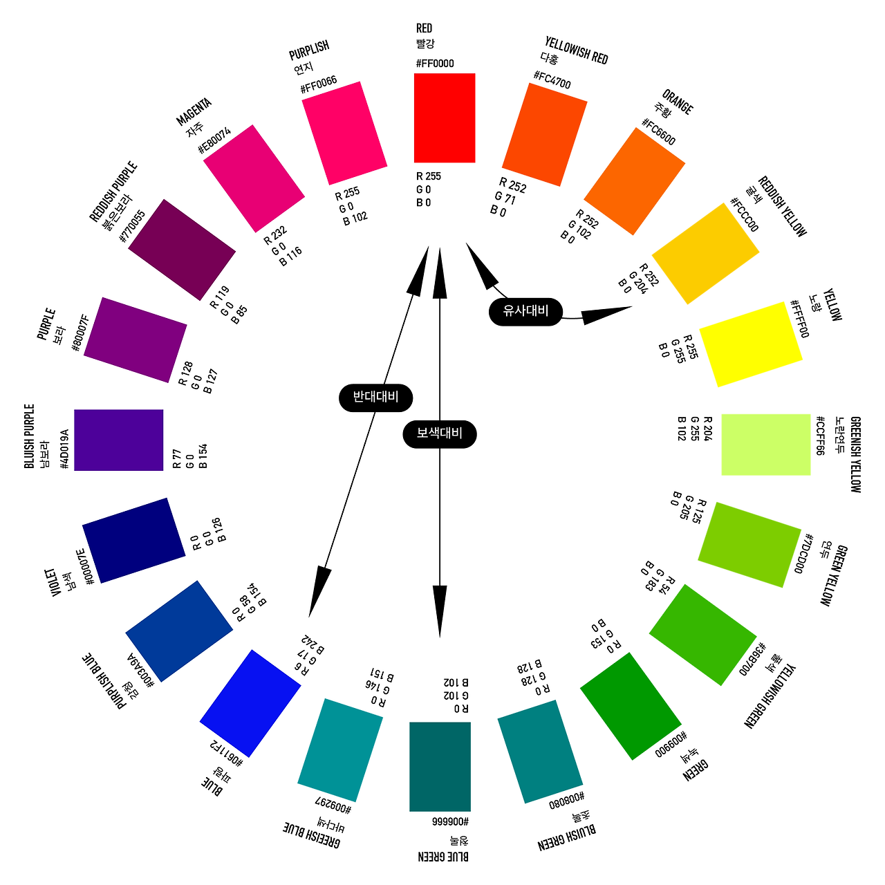

# 1. UI 설계 검토하기

<br><br>

## 1-1. UI 구현 프로세스 기획

### 1-1-1. 스타일 가이드 작성하기

| 표시 종류 | 설명 |
|-----------|--------------------------------------------------------------------|
| 색상(Color) | 사용자에게 상호작용 요소를 직관적으로 이해시키며, 버튼 같은 컨트롤에 고유의 색을 부여하고, <br> 애플리케이션의 전체 화면에 일관성 있게 사용하여 시선을 집중시키고, 행동을 유도할 수 있습니다.|
| 타이포(Typo) | 타이포그래피(Typograph)는 활자를 배열하여 표시하거나 인쇄할 때 언어를 읽을 수 있도록 호소력 있게<br> 만드는 기법과 기술을 의미합니다.|
| 아이콘(Icon) | 아이콘은 디스플레이에서 언어와 관계없이 누구나 쉽게 인지될 수 있도록한 작은 그림이나 이미지로서 <br> 의미나 해당 콘텐츠가 가지는 기능, 액션이나 상태, 정보 등을 쉽게 알 수 있도록한 그림문자를 포함합니다.  |
| 레이아웃(Layout) | 레이아웃이란, 특정 영역 안에 요소들을 배치하는 것을 의미하며, 정적인 화면 균형뿐만 아니라 <br> 서비스의 추상적인 공간의 구조를 적절하게 표현해야 합니다. |

<br>

#### 색상(Color)



<br><hr><br>

#### 타이포그래피(Typograph)


<br><hr><br>

#### 아이콘(Icon)

```comment
아이콘은 대상의 특징을 강조해 만드는 기호로 다른 언어보다 보편적으로 이해할 수 있는 시각 언어입니다. UI 아이콘, 픽토그램, 사인 등으로 대표되며 좁은 영역을 차지하면서도 의미를 전달할 수 있어 다양한 영역에서 쓰이고 있습니다. 다른 요소보다 개성을 부여하기 쉽고 시각 원리에 대한 실험을 할 수 있어 많은 디자이너의 사랑을 받고 있습니다.
```
<br><br>

#### 레이아웃(Layout)

```comment
레이아웃은 특정 영역 안에 요소를 배치하는 것입니다. 스크린에서 사용하는 레이아웃은 정적인 화면 균형뿐만 아니라 서비스의 추상적인 공간의 구조를 적절하게 표현해야 합니다. 또한 다양한 스크린에서 표시되기 때문에 어떤 환경에서도 유사한 맥락으로 사용할 수 있도록 설계합니다.
```

<br>


<br><br>

```html
<!DOCTYPE html>
<html lang="en">
<head>
    <meta charset="UTF-8">
    <meta name="viewport" content="width=device-width, initial-scale=1.0">
    <title>UI 스타일 가이드</title>
    <style>
    * { margin: 0; padding: 0; }
    body { width: 100%; overflow-x:hidden; }
    ul { list-style: none; }
    a { text-decoration: none; }
    .title { padding-top: 2rem; padding-bottom: 0.5rem;
          padding-left: 80px;}
    .comment { padding-left: 80px; font-size:18px; }
    .lst { width: 960px; margin: 24px auto; clear:both; }
    .lst:after { content:""; display:block; width: 100%; 
    clear:both; } 
    .lst li { width:150px; height: 180px; 
        float:left; margin:14px; 
     }
    .lst li .box { width: 80px; height: 80px; 
        border:2px solid #ececec; border-radius:44px; }
    p.more { width:960px; margin:10px auto; clear:both; }
    p.more a { display:inline-block; width: 45px; height: 45px; 
        border:2px solid #ececec; line-height: 45px; 
        color:#fff; background-color:deepskyblue; 
        text-align: center; font-size:28px;  }     

    .lst li.item1 .box { background-color:#246beb; } 
    .lst li.item2 .box { background-color: #7ca6f3; }
    .lst li.item3 .box { background-color:#003675; }
    .lst li.item4 .box { background-color:#2a5c96; }
    .lst li.item5 .box { background-color:#99b0cb; }
    .lst li.item6 .box { background-color:#002046; }
    .lst li.item7 .box { background-color:#ffd700; }
    .lst li.item8 .box { background-color:#81e2df; }
    .lst li.item9 .box { background-color:#808080; }
    .lst li.item10 .box { background-color:#bfbfbf; }
    .lst li.item11 .box { background-color:#333333; }

    .lst li.item1 .item_tit, .lst li.item1 .tit_com { color:#246beb; } 
    .lst li.item2 .item_tit, .lst li.item2 .tit_com { color: #7ca6f3; }
    .lst li.item3 .item_tit, .lst li.item3 .tit_com { color:#003675; }
    .lst li.item4 .item_tit, .lst li.item4 .tit_com { color:#2a5c96; }
    .lst li.item5 .item_tit, .lst li.item5 .tit_com { color:#99b0cb; }
    .lst li.item6 .item_tit, .lst li.item6 .tit_com { color:#002046; }
    .lst li.item7 .item_tit, .lst li.item7 .tit_com { color:#ffd700; }
    .lst li.item8 .item_tit, .lst li.item8 .tit_com { color:#81e2df; }
    .lst li.item9 .item_tit, .lst li.item9 .tit_com { color:#808080; }
    .lst li.item10 .item_tit, .lst li.item10 .tit_com { color:#bfbfbf; }
    .lst li.item11 .item_tit, .lst li.item11 .tit_com { color:#333333; }
    </style>
    <link rel="stylesheet" href="./fonts.css">
    <style>
    .lst.typo li { clear:both; width: 100%; height: 140px;     }
    .lst.typo li h3 { font-size:60px; line-height: 90px; }
    .lst.typo li.typo1 h3 { font-family:'nts', sans-serif; font-weight: 200; }
    .lst.typo li.typo2 h3 { font-family:'nts', sans-serif; font-weight: 400; }
    .lst.typo li.typo3 h3 { font-family:'nts', sans-serif; font-weight: 800; }
    .lst.typo li.typo4 h3 { font-family:'ntf', serif; font-weight: 300; }
    .lst.typo li.typo5 h3 { font-family:'ntf', serif; font-weight: 500; }
    .lst.typo li.typo6 h3 { font-family:'ntf', serif; font-weight: 800; }
    .lst.typo li.typo7 h3 { font-family:'nnp', cursive; font-weight: 200; }
    .lst.typo li.typo8 h3 { font-family:'nnp', cursive; font-weight: 400; }
    .lst.typo li.typo9 h3 { font-family:'nnp', cursive; font-weight: 800; }
    .lst.typo li.typo10 h3 { font-family:'nng', sans-serif; font-weight: 200; }
    .lst.typo li.typo11 h3 { font-family:'nng', sans-serif; font-weight: 400; }
    .lst.typo li.typo12 h3 { font-family:'nng', sans-serif; font-weight: 800; }
    </style>

    <link href="https://fonts.googleapis.com/icon?family=Material+Icons"
rel="stylesheet">
    <style>
    .lst.icon li { float:left; width:100px; height: 100px;     } 
    .lst.icon li span { display:block; line-height: 50px;  }
    .lst.icon li strong { display:block; line-height:20px; }
    .icons.md-18 { font-size: 18px; }
    .icons.md-24 { font-size: 24px; }
    .icons.md-36 { font-size: 36px; }
    .icons.md-48 { font-size: 48px; }    
    </style>

    <style>
    .lst.layout li { clear:both; width: 100%; min-height:250px; margin-bottom: 90px; }  
    .lst.layout li.lay1 { min-height:450px; }  
    .lst.layout li:after { content:""; display:block; width: 100%; 
    clear:both; }
    .lst.layout li img { display:block; width:400px; }
    .lst.layout li.lay3 img { display:block; width:960px; }    
    </style>
</head>
<body>
    <h1 class="title" style="font-size:48px;">UI Style Guide</h1>
    <hr>
    <h2 class="title">UI Color</h1>
    <p class="comment">UI 색상은 정보 전달과 정체성을 구축하는 요소이며, 
        각 콘텐츠를 강조, 융합, 분리하는 역할을 수행하며, 심미성을 부여하는 가장 중요한 요소입니다.</p>
    <ul class="lst">
        <li class="item1">
            <div class="box"></div>
            <h3 class="item_tit">Primary Color1</h3>
            <p class="tit_com">기본색1 - #246beb</p>
        </li>
        <li class="item2">
            <div class="box"></div>
            <h3 class="item_tit">Primary Color2</h3>
            <p class="tit_com">기본색2 - #7ca6f3</p>
        </li>
        <li class="item3">
            <div class="box"></div>
            <h3 class="item_tit">Secondary Color1</h3>
            <p class="tit_com">보조색1 - #003675</p>
        </li>
        <li class="item4">
            <div class="box"></div>
            <h3 class="item_tit">Secondary Color2</h3>
            <p class="tit_com">보조색2 - #2a5c96</p>
        </li>
        <li class="item5">
            <div class="box"></div>
            <h3 class="item_tit">Secondary Color3</h3>
            <p class="tit_com">보조색3 - #99b0cb</p>
        </li>
        <li class="item6">
            <div class="box"></div>
            <h3 class="item_tit">Secondary Color4</h3>
            <p class="tit_com">보조색4 - #002046</p>
        </li>
        <li class="item7">
            <div class="box"></div>
            <h3 class="item_tit">Point Color1</h3>
            <p class="tit_com">강조색1 - #ffd700</p>
        </li>
        <li class="item8">
            <div class="box"></div>
            <h3 class="item_tit">Point Color2</h3>
            <p class="tit_com">강조색2 - #81e2df</p>
        </li>
        <li class="item9">
            <div class="box"></div>
            <h3 class="item_tit">ETC Color1</h3>
            <p class="tit_com">기타색1 - #808080/#404040</p>
        </li>
        <li class="item10">
            <div class="box"></div>
            <h3 class="item_tit">ETC Color2</h3>
            <p class="tit_com">기타색2 - #bfbfbf/#e5e5e5</p>
        </li>
        <li class="item11">
            <div class="box"></div>
            <h3 class="item_tit">ETC Color3</h3>
            <p class="tit_com">기타색3 - #333333/#ffffff</p>
        </li>
    </ul>
    <hr>
    <h2 class="title">UI Typograph</h1>
    <p class="comment">타이포그래피는 웹 폰트를 활용하여 각 콘텐츠의 제목, 내용 등을 장식하거나
        표시하는 역할을 하고, 각 콘텐츠의 가독성을 높이는 역할을 수행합니다. </p>
    <ul class="lst typo">
        <li class="typo1">
            <h3>우리 동네 가산동을 소개합니다.</h3>
            <p>Noto Sans Kr, 200</p>
        </li>
        <li class="typo2">
            <h3>우리 동네 가산동을 소개합니다.</h3>
            <p>Noto Sans Kr, 400</p>
        </li>
        <li class="typo3">
            <h3>우리 동네 가산동을 소개합니다.</h3>
            <p>Noto Sans Kr, 800</p>
        </li>
        <li class="typo4">
            <h3>우리 동네 가산동을 소개합니다.</h3>
            <p>Noto Serif Kr, 300</p>
        </li>
        <li class="typo5">
            <h3>우리 동네 가산동을 소개합니다.</h3>
            <p>Noto Serif Kr, 500</p>
        </li>
        <li class="typo6">
            <h3>우리 동네 가산동을 소개합니다.</h3>
            <p>Noto Serif Kr, 800</p>
        </li>
        <li class="typo7">
            <h3>우리 동네 가산동을 소개합니다.</h3>
            <p>Nanum Pen Script, 200</p>
        </li>
        <li class="typo8">
            <h3>우리 동네 가산동을 소개합니다.</h3>
            <p>Nanum Pen Script, 400</p>
        </li>
        <li class="typo9">
            <h3>우리 동네 가산동을 소개합니다.</h3>
            <p>Nanum Pen Script, 800</p>
        </li>
        <li class="typo10">
            <h3>우리 동네 가산동을 소개합니다.</h3>
            <p>Nanum Gothic, 200</p>
        </li>
        <li class="typo11">
            <h3>우리 동네 가산동을 소개합니다.</h3>
            <p>Nanum Gothic, 400</p>
        </li>
        <li class="typo12">
            <h3>우리 동네 가산동을 소개합니다.</h3>
            <p>Nanum Gothic, 800</p>
        </li>
    </ul>
    <hr>
    <h2 class="title">구글 머트리얼 아이콘(Matrial Icon)</h2>
    <p class="comment">폰트 아이콘, 글리프 아이콘, 어썸 아이콘, 머트리얼 아이콘, XE아이콘, IONIC 아이콘 등 여러 웹 아이콘 적용방식이 있습니다.</p>
    <ul class="lst icon">
        <li>
            <span class="icons md-18">face</span>
            <strong>face, font-size:18px </strong>
        </li>
        <li>
            <span class="icons md-24">face</span>
            <strong>face, font-size:24px </strong>
        </li>
        <li>
            <span class="icons md-36">face</span>
            <strong>face, font-size:36px </strong>
        </li>
        <li>
            <span class="icons md-48">face</span>
            <strong>face, font-size:48px </strong>
        </li>
        <li>
            <span class="icons md-48">search</span>
            <strong>search, font-size:48px </strong>
        </li>
        <li>
            <span class="icons md-48">home</span>
            <strong>home, font-size:48px </strong>
        </li>
        <li>
            <span class="icons md-48">menu</span>
            <strong>menu, font-size:48px </strong>
        </li>
        <li>
            <span class="icons md-48">close</span>
            <strong>close, font-size:48px </strong>
        </li>
        <li>
            <span class="icons md-48">settings</span>
            <strong>settings, font-size:48px </strong>
        </li>
        <li>
            <span class="icons md-48">done</span>
            <strong>done, font-size:48px </strong>
        </li>
        <li>
            <span class="icons md-48">expand_more</span>
            <strong>expand_more, font-size:48px </strong>
        </li>
        <li>
            <span class="icons md-48">check_circle</span>
            <strong>check_circle, font-size:48px </strong>
        </li>
        <li>
            <span class="icons md-48">favorite</span>
            <strong>favorite, font-size:48px </strong>
        </li>
        <li>
            <span class="icons md-48">add</span>
            <strong>add, font-size:48px </strong>
        </li>
        <li>
            <span class="icons md-48">delete</span>
            <strong>delete, font-size:48px </strong>
        </li>
        <li>
            <span class="icons md-48">arrow_back</span>
            <strong>arrow_back, font-size:48px </strong>
        </li>
        <li>
            <span class="icons md-48">star</span>
            <strong>star, font-size:48px </strong>
        </li>
        <li>
            <span class="icons md-48">chevron_right</span>
            <strong>chevron_right, font-size:48px </strong>
        </li>
        <li>
            <span class="icons md-48">logout</span>
            <strong>logout, font-size:48px </strong>
        </li>
        <li>
            <span class="icons md-48">arrow_forward</span>
            <strong>arrow_forward, font-size:48px </strong>
        </li>
        <li>
            <span class="icons md-48">add_circle</span>
            <strong>add_circle, font-size:48px </strong>
        </li>
        <li>
            <span class="icons md-48">cancle</span>
            <strong>cancle, font-size:48px </strong>
        </li>
        <li>
            <span class="icons md-48">arrow_back_ios</span>
            <strong>arrow_back_ios, font-size:48px </strong>
        </li>
        <li>
            <span class="icons md-48">arrow_forward</span>
            <strong>arrow_forward, font-size:48px </strong>
        </li>
        <li>
            <span class="icons md-48">arrow_drop_down</span>
            <strong>arrow_drop_down, font-size:48px </strong>
        </li>
        <li>
            <span class="icons md-48">more_vert</span>
            <strong>more_vert, font-size:48px </strong>
        </li>
        <li>
            <span class="icons md-48">check</span>
            <strong>check, font-size:48px </strong>
        </li>
        <li>
            <span class="icons md-48">check_box</span>
            <strong>check_box, font-size:48px </strong>
        </li>
        <li>
            <span class="icons md-48">open_in_new</span>
            <strong>open_in_new, font-size:48px </strong>
        </li>
        <li>
            <span class="icons md-48">toggle_on</span>
            <strong>toggle_on, font-size:48px </strong>
        </li>

        <li>
            <span class="icons md-48">grade</span>
            <strong>grade, font-size:48px </strong>
        </li>
        <li>
            <span class="icons md-48">refresh</span>
            <strong>refresh, font-size:48px </strong>
        </li>
        <li>
            <span class="icons md-48">check_box_outline_blank</span>
            <strong>check_box_outline_blank, font-size:48px </strong>
        </li>
        <li>
            <span class="icons md-48">login</span>
            <strong>login, font-size:48px </strong>
        </li>
        <li>
            <span class="icons md-48">chevron_left</span>
            <strong>chevron_left, font-size:48px </strong>
        </li>
        <li>
            <span class="icons md-48">expand_less</span>
            <strong>expand_less, font-size:48px </strong>
        </li>
        <li>
            <span class="icons md-48">radio_button_unchecked</span>
            <strong>radio_button_unchecked, font-size:48px </strong>
        </li>
        <li>
            <span class="icons md-48">radio_button_checked</span>
            <strong>radio_button_checked, font-size:48px </strong>
        </li>
        <li>
            <span class="icons md-48">more_horiz</span>
            <strong>more_horiz, font-size:48px </strong>
        </li>
        <li>
            <span class="icons md-48">download</span>
            <strong>download, font-size:48px </strong>
        </li>
        <li>
            <span class="icons md-48">apps</span>
            <strong>apps, font-size:48px </strong>
        </li>
        <li>
            <span class="icons md-48">arrow_right_alt</span>
            <strong>arrow_right_alt, font-size:48px </strong>
        </li>
        <li>
            <span class="icons md-48">remove</span>
            <strong>remove, font-size:48px </strong>
        </li>
        <li>
            <span class="icons md-48">bolt</span>
            <strong>bolt, font-size:48px </strong>
        </li>
        <li>
            <span class="icons md-48">toggle_off</span>
            <strong>toggle_off, font-size:48px </strong>
        </li>
        <li>
            <span class="icons md-48">arrow_upward</span>
            <strong>arrow_upward, font-size:48px </strong>
        </li>
        <li>
            <span class="icons md-48">filter_list</span>
            <strong>filter_list, font-size:48px </strong>
        </li>
        <li>
            <span class="icons md-48">delete_forever</span>
            <strong>delete_forever, font-size:48px </strong>
        </li>
        <li>
            <span class="icons md-48">autorenew</span>
            <strong>autorenew, font-size:48px </strong>
        </li>
        <li>
            <span class="icons md-48">key</span>
            <strong>key, font-size:48px </strong>
        </li>
        <li>
            <span class="icons md-48">sync</span>
            <strong>sync, font-size:48px </strong>
        </li>
        <li>
            <span class="icons md-48">block</span>
            <strong>block, font-size:48px </strong>
        </li>

        <li>
            <span class="icons md-48">arrow_downward</span>
            <strong>arrow_downward, font-size:48px </strong>
        </li>
        <li>
            <span class="icons md-48">sort</span>
            <strong>sort, font-size:48px </strong>
        </li>
        <li>
            <span class="icons md-48" style="color:gold">add_box</span>
            <strong>add_box, font-size:48px </strong>
        </li>
        <li>
            <span class="icons md-48" style="color:gold">arrow_back_ios_new</span>
            <strong>arrow_back_ios_new, font-size:48px </strong>
        </li>
        <li>
            <span class="icons md-48" style="color:gold">restart_alt</span>
            <strong>restart_alt, font-size:48px </strong>
        </li>
        <li>
            <span class="icons md-48" style="color:gold">shopping_cart_checkout</span>
            <strong>shopping_cart_checkout, font-size:48px </strong>
        </li>
        <li>
            <span class="icons md-48" style="color:gold">menu_open</span>
            <strong>menu_open, font-size:48px </strong>
        </li>
        <li>
            <span class="icons md-48" style="color:gold">expand_circle_down</span>
            <strong>expand_circle_down, font-size:48px </strong>
        </li>
        <li>
            <span class="icons md-48" style="color:gold">undo</span>
            <strong>undo, font-size:48px </strong>
        </li>
        <li>
            <span class="icons md-48" style="color:gold">backspace</span>
            <strong>backspace, font-size:48px </strong>
        </li>
        <li>
            <span class="icons md-48" style="color:gold">arrow_circle_right</span>
            <strong>arrow_circle_right, font-size:48px </strong>
        </li>
        <li>
            <span class="icons md-48" style="color:gold">done_all</span>
            <strong>done_all, font-size:48px </strong>
        </li>
    </ul>
    <p class="more">구글 머트리얼 아이콘 더보기 : <a href="https://fonts.google.com/icons">+</a></p>
    <p class="more">글리프(Glyph) 아이콘 더보기 : <a href="https://www.glyphicons.com/">+</a></p>
    <p class="more">어썸(Awesome) 아이콘 더보기 : <a href="https://fontawesome.com/">+</a></p>
    <p class="more">다폰트 아이콘 더보기 : <a href="https://www.dafont.com/theme.php?cat=717">+</a></p>
    <p class="more">XE 아이콘 더보기 : <a href="https://xpressengine.github.io/XEIcon/index.html">+</a></p>
    <p class="more">IONIC 아이콘 더보기 : <a href="https://ionic.io/ionicons">+</a></p>
    <hr>
    <h2 class="title">레이아웃</h2>
    <p class="comment">페이지에 대한 레이아웃</p>
    <ul class="lst layout">
        <li class="lay1"><strong>메인 페이지 레이아웃</strong></li>
        <li class="lay2"><strong>서브 페이지 레이아웃</strong></li>
        <li class="lay3"><strong>반응형 레이아웃</strong></li>
    </ul>
</body>
</html>
```

<br><br>

### 1-1-2. 공통 컴포넌트(Component) 및 위젯(Widget) 작성하기

| 위젯 종류 | 설명 |
|-----------|--------------------------------------------------------------------|
| 메인메뉴 | 웹 애플리케이션에서 주 메뉴를 가리키며, 웹 애플리케이션에 존재하는 모든 페이지나 콘텐츠의 제목 등을 <br> 모아 놓아 메뉴로 구성한 것  |
| 상단메뉴 | 웹 애플리케이션에서 주로 상단 오른쪽이나 중앙에 배치하며, 로그인, 회원가입, 오시는 길 등 많이 사용하는 <br> 기능만을 따로 모아 놓은 메뉴  |
| 로컬메뉴 | 웹 애플리케이션의 서브 페이지 등의 왼쪽 측면부에 배치하며, 해당 페이지의 카테고리의 상세 페이지 등으로 <br> 이동할 수 있도록 한 메뉴   |
| 퀵메뉴 | 웹 애플리케이션에서 오른쪽 부분에 배치하며, 화면 스크롤시에도 항상 그 자리에 배치하여 최상단에 존재하는 <br> 메인메뉴로 이동하지 않고도 언제든지 핵심 콘텐츠나 페이지로 이동할 수 있도록 한 메뉴 |
| 하단메뉴 | 웹 애플리케이션의 푸터인 하단부에 배치하며, 클라이언트가 대부분 모든 콘텐츠를 관찰하고 나서 진행해야 하는 <br> 내용인 회원약관이나 개인정보처리방침, 상담센터 등이 배치되는 메뉴   |
| 브레드크럼 | 클라이언트가 웹 애플리케이션을 서핑하다가 길을 잃지 않도록 현재가 어떠한 카테고리에 해당하는 페이지에 <br> 있는지 그 위치를 알려 주도록한 메뉴 |
| 버튼 | 버튼(Button) 요소는 사용자가 데이터를 전송하거나 다른 페이지나 화면으로 이동 또는 해당 기능을 실행하도록 하는 요소 |
| 탭 | 여러 콘텐츠를 한 꺼번에 표시하지 못하는 경우 해당 버튼을 누르면, 그에 해당하는 콘텐츠를 교대로 보여 줄 수 있도록 구성한 요소 |
| 아코디언 | 해당 카테고리에 해당하는 메뉴를 선택하게 되면, 그에 해당하는 상세내용을 보여주고, 다른 카테고리에 속하는 상세내용을 숨기도록 하는 요소 |
| 컬랩시블 | 다른 카테고리 메뉴와 관계없이 해당 카테고리의 상세내용을 보여주거나 숨기도록 하는 요소 |
| 모달 | 대화상자(Dialog)라고도 하며, 창(Window) 라고도 할 수 있으며, 레이어 형태와 윈도우 형태로 나눔 |

<br>

### 1-1-3. 상세 컴포넌트(Component) 및 위젯(Widget) 작성하기

| 위젯 종류 | 설명 |
|-----------|--------------------------------------------------------------------|
| 슬라이드배너 | 배너 콘텐츠를 옆 또는 상하로 슬라이딩되면서 교대로 보여 줄 수 있는 요소 |
| 콤보상자 | 해당 요소를 활성화할 경우 아래로 펼쳐지며, 목록을 보여주는 요소 |
| 슬라이더 | 해당 요소에 대한 값을 드래그 또는 클릭해가면서 조절할 수 있는 요소  |
| 컨트롤패널 | 제어패널을 의미하며, 해당 콘텐츠의 내용을 설정하거나 상태를 볼 수 있도록 구성한 제어가 가능하도록 만든 패널 |


<br><br>

## 1-2. UI 구현 프로세스 검토

<br>

### 1-2-1. 사용성 테스트 유형 적용하기

| 유형 | 설명 |
|-----------|--------------------------------------------------------------------|
| 페르소나 | 어떤 제품, 혹은 서비스를 사용할 만한 목표 인구집단 안에 있는 다양한 사용자 유형들을 대표하는 가상의 인물을 설정하고 하는 테스트이다. |
| DIY 평가 | 적은 인원(3~5명)으로 빠른 시간 내에 테스트하여 당장 개선할 문제를 추출하는 테스트이다. |
| Eye-Tracking | 사용자에게 시스템을 보여주고 업무 화면에 대한 눈동자의 움직임을 추적하는 테스트이다. |
| Morae | 관찰자, 관리자로 구성되어 도구를 통해 사용자에게 단계별 지시를 하고 업무 동선을 녹화, 테스트하는 기법이다. |
| 카드소팅 | 주어진 카드를 그룹핑하는 그룹에 이름을 부여, 사용자가 어떻게 서비스를 구조적으로 이해하는지 관찰하는 테스트이다. |
| A/B 테스트 | 임의로 나뉜 두 집단의 반응, 혹은 두 가지를 선택하는 테스트이다. |

<br>

### 1-2-2. UI 검토 의견 제시하기

- 3P(Personal, Physical Evicdence, Process Management) 관점 분석
- 사용성 테스트로 발견된 문제점 종합, 문제점 상세, 심각성 분석, 개선 우선순위 분석을 포함하여 작성

<br><hr><br>

# 2. UI 구현 표준 검토하기

<br><br>

## 2-1. UI 구현 요구사항 분석

<br>

### 2-1-1. UI 구현 요구사항 분석 기법

- FGI(Focus Group Interview) : 특정 집단 내에서 중점 인터뷰 대상을 추출하여 이를 통해 심층적인 의견과 
요구사항을 도출하는 정성적 조사 기법
- 페르소나(Persona) : 특정한 환경에서의 사용자 패턴, 행동, 생각, 감정 등을 예측하기 위해 실제 사용자들의 데이터를 바탕으로 설정된 가상의 대표 사용자를 활용하는 기법
- 필드 스터디(Field Study) : 필드에서의 사용자를 직접 관찰하고 주요 이슈를 파악하는 활동
- 5whys : 특정 문제에 대하여 심층적으로 탐색하고 필요사항을 도출하기 위한 기법
- 프로토타이핑(Prototyping) : 중요한 요구사항에 대해 이해 관계자의 이해가 불분명하거나 모호할 경우 해당 요구사항에 대한 최종 산출물의 개략적인 모형을 간단하고 빠르게 만들어 시각적으로 제공함으로써 요구사항을 구체화하는 기법

<br><br>

## 2-2. UI 구현 표준안 작성

<br><br>

### 2-2-1. UI 구현 표준 수립하기

<br>

### 2-2-2. 스토리보드(Storyboard) 작성하기

- 스토리보드는 전체 UI에 대한 정책과 흐름, 그리고 디자인 콘셉트에 기반한 콘텐츠 구성 등 모든 UI 관련 내용이 작성되어 있는 문서이다.

<br>

### 2-2-3. 와이어 프레임(Wire-frame) 작성하기

- 와이어 프레임은 말 그대로 서비스를 구성하는 레이아웃을 간단히 스케치한 것으로, 전체 인터페이스 구성을 시각적으로 제공한다.

<br>

### 2-2-4. 각 화면 구현하기

<br><hr><br>